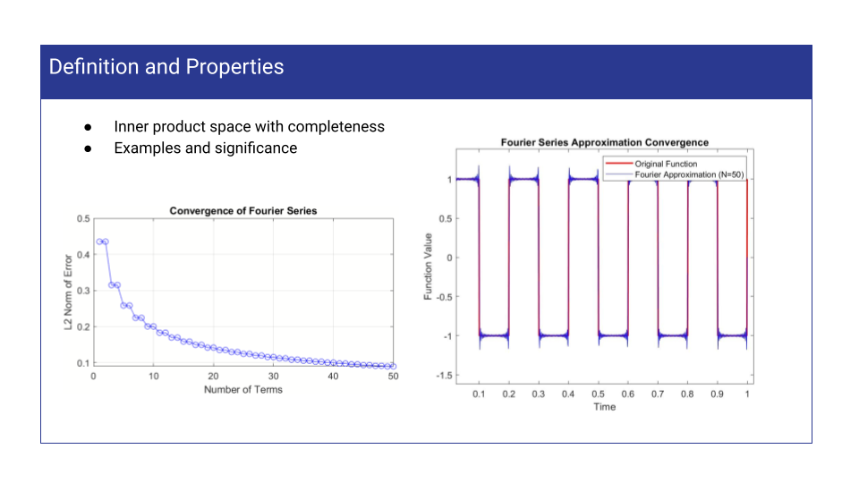

# University Projects, Semester 6:
Mathematical Analysis course, University of Tehran Jun 2024
# Hilbert spaces and Fourier Series
This repository contains MATLAB scripts and documentation for a project on Hilbert spaces and Fourier series. The project aims to provide a deeper understanding of these mathematical concepts through practical examples and visualizations.
# List of codes
- completeness.m
- Convergence.m
- L2_space.m
- orthogonal.m
- Parseval.m
- Projection.m
- Projection_in_fourier_series.m
# Results

.png)
.png)
.png)
